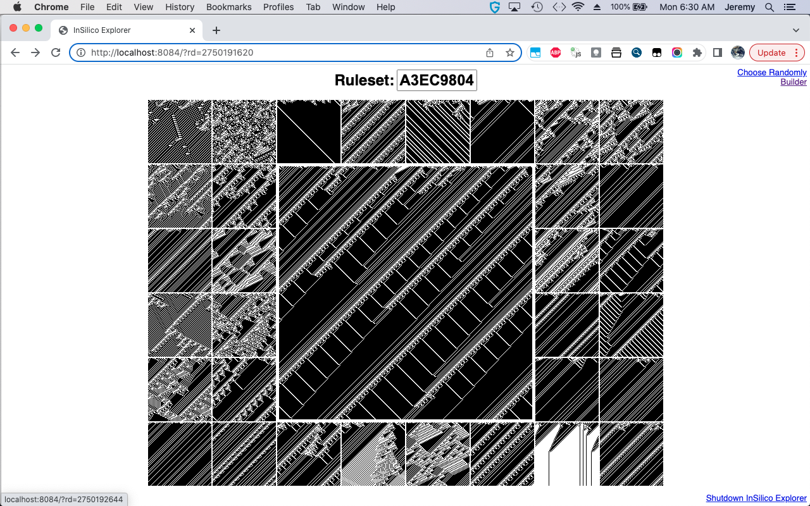

# insilico

Runs an augmented 1D elementary cellular automaton with two cell states and a 
five cell neighborhood and creates a PNG image where each pixel in a row 
represents a cell and each row represents a successive generation of the CA.

```
Usage of ./insilico:
  -R string
        Set ruleset. (8 digit hex) Note: -r will be ignored.
  -b string
        Set dead cell color (hex). (default "000000")
  -explorer
        Start in explorer mode. Runs a webserver on localhost:8084
  -m string
        Set init mode. random|center|ctralt|repeat|live|dead (default "random")
  -o string
        Set the output file. (default "image.png")
  -p percentage
        Set random init percentage. (default 0.5)
  -r int
        Set ruleset. Choose random one if negative. (default -1)
  -s string
        Set start pattern. (default "1")
  -seed int
        Set the seed. Use the system time if negative. (default -1)
  -w string
        Set live cell color (hex). (default "FFFFFF")
  -x width
        Set the width in pixels. (default 400)
  -y height
        Set the height in pixels. (default 400)
```

Although not documented in the usage message, if the filename specified with 
the -o flag contains at least one '#' character, the first of them will be 
replaced with the ruleset as a decimal integer. Similarly, if it contains at
least one '$' character, the first of them will be replaced with the ruleset
as a hexadecimal integer. Both special characters may be used at the same time.

Explorer Mode
-------------
If started with the -explorer flag, insilico starts a webserver on localhost.
By default it uses port 8084. It will also attempt to launch a browser and 
connect to the server. If it fails to launch a browser, you can do so manually
and enter http://localhost:8084/ in the browser's address bar. 

Insilico's explorer mode webapp is useful for exploring the CA Ruleset space. 
On the "Chooser" page (which is the page you start on) the current CA is 
displayed in the middle surrounded by 32 smaller CA images, each made by
mutating the current CA ruleset. A mutation is simply a bit flip. A click on 
any of these smaller images will make its ruleset current, show it as the
large middle image, and display its 32 mutations. 

Clicking on the large image on the "Chooser" page brings you to the "Scope"
page. On this page, there are options for changing the size, colors, and 
initialization parameters for the CA. Tweak these and submit to get a new
image. There is a link below the form to return to the Chooser page. 

On the bottom right of all pages, there is a link for shutting down the 
InSilico webapp.




